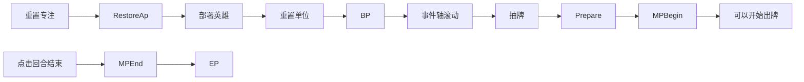

<!-- TOC -->

- [1. 遭遇（Encounter）](#1-遭遇encounter)
    - [1.1. 自大地图获得的数据](#11-自大地图获得的数据)
    - [1.2. 胜利与失败条件](#12-胜利与失败条件)
- [2. 玩家](#2-玩家)
    - [2.1. 专注（AP）](#21-专注ap)
    - [2.2. 手牌上限](#22-手牌上限)
    - [2.3. 死页（Death Page）](#23-死页death-page)
    - [2.4. 遭遇专长](#24-遭遇专长)
- [3. 地图](#3-地图)
    - [3.1. 格子](#31-格子)
        - [3.1.1. 异常地形类别](#311-异常地形类别)
    - [3.2. 战区](#32-战区)
        - [3.2.1. 控制者](#321-控制者)
        - [3.2.2. 战区增益](#322-战区增益)
        - [3.2.3. 战区争夺](#323-战区争夺)
- [4. 英雄](#4-英雄)
- [5. 卡牌](#5-卡牌)
    - [5.1. 卡牌区域](#51-卡牌区域)
        - [5.1.1. 手牌](#511-手牌)
        - [5.1.2. 牌库](#512-牌库)
        - [5.1.3. 待命区](#513-待命区)
    - [5.2. 卡牌类型](#52-卡牌类型)
        - [5.2.1. 召唤牌](#521-召唤牌)
        - [5.2.2. 指令牌](#522-指令牌)
    - [5.3. 卡牌属性](#53-卡牌属性)
        - [5.3.1. 卡牌ID](#531-卡牌id)
        - [5.3.2. 卡牌名称和标签](#532-卡牌名称和标签)
        - [5.3.3. 卡牌颜色](#533-卡牌颜色)
        - [5.3.4. 卡牌费用](#534-卡牌费用)
        - [5.3.5. 增益异能](#535-增益异能)
        - [5.3.6. 咒语牌属性](#536-咒语牌属性)
    - [5.4. 游戏中卡牌实例具有的额外属性](#54-游戏中卡牌实例具有的额外属性)
        - [5.4.1. 携带者](#541-携带者)
    - [5.5. 卡牌的升级](#55-卡牌的升级)
        - [5.5.1. 卡牌强化](#551-卡牌强化)
        - [5.5.2. 卡牌铭转](#552-卡牌铭转)
- [6. 单位](#6-单位)
    - [6.1. 单位的部署](#61-单位的部署)
    - [6.2. 单位动作系统](#62-单位动作系统)
    - [6.3. 单位属性](#63-单位属性)
        - [6.3.1. 攻击力（ATK）](#631-攻击力atk)
        - [6.3.2. 最大生命值（MHP）](#632-最大生命值mhp)
        - [6.3.3. 移动力（MOV）](#633-移动力mov)
        - [6.3.4. 攻击距离（RNG）](#634-攻击距离rng)
        - [6.3.5. 携带的异能id（Ability）](#635-携带的异能idability)
        - [6.3.6. 适性（Enhence）](#636-适性enhence)
        - [6.3.7. 攻击速度（SPD）](#637-攻击速度spd)
        - [6.3.8. 攻击次数(AT)](#638-攻击次数at)
        - [6.3.9. 移动次数（MT）](#639-移动次数mt)
        - [6.3.10. 施法次数(CT)](#6310-施法次数ct)
    - [6.4. 进攻](#64-进攻)
        - [6.4.1. 战斗结算](#641-战斗结算)
        - [6.4.2. 伤害（Damage）和伤害指令（DamageComand）](#642-伤害damage和伤害指令damagecomand)
- [7. 异能（Ability）与效果（Effect）](#7-异能ability与效果effect)
    - [7.1. 异能种类](#71-异能种类)
        - [7.1.1. 静止式异能](#711-静止式异能)
        - [7.1.2. 触发式异能](#712-触发式异能)
    - [7.2. 范围](#72-范围)
        - [7.2.1. 射线范围](#721-射线范围)
        - [7.2.2. 爆发范围](#722-爆发范围)
- [8. 符文](#8-符文)
- [9. 遭遇流程](#9-遭遇流程)
- [10. 事件](#10-事件)
    - [10.1. 随机事件池](#101-随机事件池)
    - [10.2. 事件轴](#102-事件轴)

<!-- /TOC -->

# 1. 遭遇（Encounter）

遭遇，是指在大地图上遇到特定的事件之后进入的一整个战斗过程。进入遭遇的时候，玩家将离开大地图进入特定遭遇的地图，进行战斗。包括使用手牌，操控单位。

## 1.1. 自大地图获得的数据

+ 玩家拥有的专注最大值（见[专注（AP）](#21-专注ap)）
+ 玩家的最大手牌数（见[手牌上限](#22-手牌上限)）
+ 玩家身上附带有的其他复杂遭遇专长

## 1.2. 胜利与失败条件

胜败条件会随着遭遇设置的不同发生变化。胜败条件的实现方式为战区触发器或全局触发器，详情见万法大全。

# 2. 玩家

你在一场遭遇中拥有若干的卡牌和单位，通过调度卡牌、进行单位的基本操作来达成一次遭遇的游戏目标。

## 2.1. 专注（AP）

专注是你用来施放卡牌时支付给卡牌的“费用”，是玩家可以调度的资源之一。

玩家有一个变量“专注上限”。玩家的专注上限值在遭遇初始化的时候由玩家在大地图上所具有的数据决定。专注上限数值在遭遇进行过程中可能因为各种各样的东西改变，他限制了玩家一回合可以进行的操作数。每个你的回合开始之前，你会获得或失去若干点专注使你的专注达到专注上限。

你使用卡牌时需要消耗专注，详情见 [卡牌](#5-卡牌) 。

## 2.2. 手牌上限

玩家有一个变量“手牌上限”，手牌上限数值在遭遇初始化的时候有玩家在大地图上所具有的数据决定。

当你尝试抽牌时，若你已经达到了手牌上限，你会抽不了牌。

+ 当你拥有7张手牌，你使用了A：抽1张牌。那么在你使用这张牌的时候你的手牌数已经变为了6，你会抽一张牌。
+ 当你拥有7张手牌，你使用了B：抽2张牌。那么在你使用这张牌的时候你的手牌数已经变为了6，你会抽一张牌，另一张牌不抽。
+ 当你拥有了7张手牌，你使用了C：抽三张牌，随后选择两张手牌洗回牌库，那么你将抽一张牌，随后将两张手牌洗回牌库。

## 2.3. 死页（Death Page）

玩家在部分特殊遭遇中会具有一个变量“死页”，这个数值在遭遇开始的时候为0。同样的，玩家会获得一个变量“死页上限”，这个变量在遭遇初始化的时候由本次遭遇的设置决定。当玩家具有的死页数值达到甚至超过死页上限时，玩家将会因此落败。

## 2.4. 遭遇专长

玩家可能会因为在大地图上获取的特定道具或者为英雄选取的特定天赋获得遭遇专长。遭遇专长是一系列在遭遇开始时开始对遭遇产生影响的类异能（Abilitylike），类似于全局buff。

# 3. 地图

地图由若干个四边形格子组成。格子上会有一些附加信息，同时会放置有单位。

单位的移动方式是四通行，即上下左右四个格子对于当前格子的距离为1，左上、右上、左下、右下的格子对于当前格子的距离为2。

## 3.1. 格子

格子是地图的组成部分，用来放置单位。一个格子上原则只能放置一个单位。

格子会附加以下信息：

+ 所放置的单位；
+ 所属战区；
+ 地形。

### 3.1.1. 异常地形类别

+ 粘滞：经过此地形的单位获得绊足状态，持续一回合。
+ 烧灼：经过此地形的单位受到一点伤害，回合开始时位于此地形上的单位会受到1点伤害。
+ 诅咒：回合结束时，位于此地形上的单位获得Debuff诅咒，持续一回合。
+ 迷雾：位于此地形上的单位获得Debuff目盲。

## 3.2. 战区

战区是一些格子组成的集合。原则上战区是连通的，也就是指从战区的某一个格子到另一个格子一定存在一条不走出战区的路线。

### 3.2.1. 控制者

一个战区存在一个控制者，这个控制者指的是你或者对手。

当一个不由你操控的战区上只放置了你的单位，没有你对手的单位时，你获得这个战区的控制权。

### 3.2.2. 战区增益

战区增益是一些响应战区控制权变更生效的触发器。他们随着战斗地图初始化被挂在到对应的战区上。

+ 增加一点专注上限
+ 立即部署一个临时的友方单位
+ 对此区域内单位的数值影响
+ 增加每回合抽牌数
+ 洗入衍生牌进入你的牌库
+ 获得大地图资源
+ 完成剧情事件

### 3.2.3. 战区争夺

当一个战区同时放置有你和对手的单位时，此战区进入争夺状态。

特别的，仅仅进入争夺状态不会发生控制权改变。

# 4. 英雄

英雄是一种特殊的单位，但是因为其运作的特殊性，在此单列出来说。

你的队伍由英雄组成，他们携带有一定数量的法咒，也就是卡牌。这些法咒牌有两个功能，一个是强化英雄单位（类似于一般游戏的装备），二是组成玩家在战斗时的牌库。

英雄在游戏中阵亡时并不会与一般的单位一样在游戏概念中被抹除，而是会进入一个恢复区进行冷却。每个英雄要冷却的回合数不同。

每个冷却完毕的英雄（虚构层上是整装待发）会在准备步骤时被要求部署下去。每个英雄默认在部署的回合就可以行动。

尽管英雄只是个单位，但其依然有对应的卡面用于在恢复区显示。

# 5. 卡牌

卡牌是你的主要致胜资源和手段。卡牌的获得和配装到英雄身上在大地图完成。虚构层上，卡牌是英雄在冒险旅途中自古老书库习得的古代法咒，可以召唤远古造物或是变成强大的魔法。

## 5.1. 卡牌区域

卡牌区域是卡牌可能存在的地方。卡牌一共可能存在于三个地方。

### 5.1.1. 手牌

手牌是你当前能够调度的卡牌资源。

### 5.1.2. 牌库

牌库是牌的集合，遭遇开始的时候他会由你英雄携带的法咒牌构成。每个回合开始时，你将可以从其中抽牌。

当你尝试从一个空牌库抽牌时，你将抽不到牌。除非特别说明，不会发生其他的事件。

### 5.1.3. 待命区

本回合你所使用的、不会被销毁的咒语牌和本回合你所阵亡的单位所携带的召唤牌会被放置于此，于你的回合开始步骤洗回牌库之中。

## 5.2. 卡牌类型

我们的卡牌主要有以下两种类型。

### 5.2.1. 召唤牌

你使用召唤牌来召唤出生物为你作战。使用召唤牌将部署下召唤牌所对应的单位，详情见[单位的部署](#61-单位的部署)。

### 5.2.2. 指令牌

指令牌是一种使用后即时生效的牌张，不对应任何单位。

## 5.3. 卡牌属性

卡牌属性是卡牌在卡牌数据库中所具有的一些特性，具体到卡牌实例时会有不同。卡牌属性大致上可以分为两种：

+ 固定属性：卡牌实例所具有的这些属性在游戏进行过程中不会发生变更，始终与卡牌数据库中的内容保持一致。
+ 动态属性：卡牌实例所具有的这些属性随着游戏进行可能发生变更。

### 5.3.1. 卡牌ID

卡牌在卡牌数据库中被查询其初始面板数据的唯一凭据。固定属性。

### 5.3.2. 卡牌名称和标签

一张卡牌的名字。一张卡牌在升级之后其名称跟原卡牌依然是一致的。固定属性。

卡牌的标签指的是他在风味上的分类。如种族标签：人类、叶族、门卡；职业标签：弓手、骑手等。

### 5.3.3. 卡牌颜色

卡牌有五个颜色：

+ 白：无特征，通用牌池
+ 红：力量型，强调威力、杀伤和坚实的身板
+ 绿：敏锐型，强调灵活、敏捷和多样的战术
+ 蓝：智慧型，强调魔法、反制和资源的调度
+ 紫：魅力型，强调配合、共振和丰富的手段

一个卡牌可能具有多个颜色。固定属性。

### 5.3.4. 卡牌费用

使用此牌时需要消耗的专注。动态属性。

### 5.3.5. 增益异能

一个卡牌提供给他的携带者的额外异能的异能列表。动态属性。

### 5.3.6. 咒语牌属性

+ 所携带的咒语id（Spell）

虽然大多数情况下他不会变，然而这确实是一个潜在的动态属性。

这些都是动态属性。

## 5.4. 游戏中卡牌实例具有的额外属性

卡牌实例所具有的属性包括上述的所有卡牌属性，在此基础上还加入了一部分仅在游戏进行过程中产生的卡牌属性。这些卡牌属性不存在完全的固态属性，但是也包含如下一类特殊的属性：

+ 相对固态属性：在战斗过程中不会变化的属性，被大地图给出的初始数据所唯一确定。

### 5.4.1. 携带者

携带者是指携带此法咒牌的英雄单位。

相对固态属性。一张法咒（卡牌）的携带者一经确定，在正常战斗中其携带者都将是这位英雄。

## 5.5. 卡牌的升级

卡牌可以在大地图进行一定的升级。升级后的卡牌具有更加强力的效果。

### 5.5.1. 卡牌强化

卡牌强化是在保留这张卡牌的基础功能、不改变其大致方向基础上进行的强化。基本只停留在量变的层面，而非质变。

### 5.5.2. 卡牌铭转

卡牌铭转是改变这张卡牌方向的提升，或加深自身颜色的特色，或掺杂入其他颜色的理念。目的以质变为主。

# 6. 单位

单位是地图格子中放置的作战单位。是你的主要打手。

每个单位具有一个单位ID来标识他在数据库中的数据。

## 6.1. 单位的部署

当单位的部署发生时，你会获得一个即将被部署的单位。你将选择一个由你控制且未陷入争夺的战区中的格子将其放置下来。刚部署的单位不能进行移动和攻击。

## 6.2. 单位动作系统

单位可以进行两种动作：移动动作和标准动作。其中标准动作包括施法和攻击。

一个回合中，一个单位默认可以进行一次移动动作和一次标准动作。有卡牌可以赋予单位移动和标准动作。

## 6.3. 单位属性

### 6.3.1. 攻击力（ATK）

单位所具有的攻击力。在没有异能的影响下，这些决定了单位所能造成的无修饰伤害。

### 6.3.2. 最大生命值（MHP）

单位生命值的最大值。

### 6.3.3. 移动力（MOV）

单位一次移动所能走的最远距离。

### 6.3.4. 攻击距离（RNG）

单位能攻击到的最大范围内的敌人。

### 6.3.5. 携带的异能id（Ability）

单位所具有的特殊能力。详情见

### 6.3.6. 适性（Enhence）

适性会增强该单位所使用的咒语牌中对应颜色的描述符，也会增强该单位造成的对应描述符的伤害。

### 6.3.7. 攻击速度（SPD）

攻击速度是产生伤害请求数目和确定伤害请求优先级的唯一凭据。

单位的攻击速度、对应产生的伤害请求数目与各伤害请求优先级的关系如下表：

攻击速度|伤害请求数|伤害1|伤害2|伤害3
---|---|---|---|---
-4|1|-4|-|-
-3|1|-3|-|-
-2|1|-2|-|-
-1|1|-1|-|-
0|1|0|-|-
1|1|1|-|-
2|2|2|0|-
3|2|3|1|-
4|2|4|2|-
5|3|5|3|0

产生攻击请求的时候，被攻击方的攻击请求数目不能超过进攻方的攻击请求数目。

下面三个属性属于实现层和规则层的概念，不暴露给玩家。

### 6.3.8. 攻速修正值（PriSPD）

这个数值会修改你每个伤害请求的优先级。比如一个PriSpd为2、SPD为3的单位会攻击两次，第一次的priority是5，第二次是3。

### 6.3.9. 攻击次数(AT)

单位的进攻行动和施法行动会消耗AT。每个单位默认具有1点默认AT。刚部署的单位没有AT。每个回合开始时，单位会恢复AT直到默认AT。

### 6.3.10. 移动次数（MT）

单位的移动行为会消耗MT。每个单位默认具有1点默认MT。刚部署的单位没有MT。每个回合开始时，单位会恢复MT直到默认MT

### 6.3.11. 施法次数(CT)

单位进行施法行动时，如果其具有CT，则会消耗CT。大多数单位默认CT为0。不同于MT和AT单位部署的时候就会获得CT。

## 6.4. 进攻

进攻是单位的一种行动，进行一次进攻行动需要消耗一次行动次数。一个具有迅捷的单位在部署的回合可以马上进攻。进攻包括一次移动和一次攻击。

### 6.4.1. 战斗结算

单位发起一次攻击之后，其与攻击目标进入战斗状态。随后他们根据他们的攻击速度产生伤害请求，并将这些产生的伤害请求依照其优先级排列。随后按照优先级依次发生并造成。其中超过攻击方攻击范围的攻击请求会被丢弃。

攻击方会获得额外的1点攻速修正值。

关于伤害请求的具体产生方式，见

### 6.4.2. 伤害（Damage）和伤害指令（DamageComand）

伤害具有两个成分：伤害量。

伤害指令具有三个成分：伤害来源（可能为空）、伤害对象和伤害。

# 7. 异能（Ability）与效果（Effect）

异能是单位所具有的一系列能力。效果是来自异能或咒语的游戏行为，如造成伤害、添加buff等等。

异能可能会添加触发器（用于触发式异能，如战吼、亡语等），也可能仅在生效时修改单位属性（用于静止式异能，如迅捷、光环）。

## 7.1. 异能种类

异能分为两类：静止式异能和触发式异能。二者在实现上的差别是一个在异能挂载在单位身上并且初始化完毕的时候就已经起效，也就是他的主要工作在初始化中进行；而后者的实现依赖于触发器。

### 7.1.1. 静止式异能

静止式异能是一类伴随着单位的异能，在游戏概念上单位的诞生与其具有静止式异能是同时发生的事情（当然在代码层面上有执行顺序的差别，单位获得静止式异能和他实例化并非同时的），这也决定了单位的静止式异能不能通过触发器的方式实现。

以下是常见的单位的静止式异能：

+ 迅捷：此单位部署的回合就获得了一次行动次数。
+ 迟滞X：此单位产生的所有攻击请求优先级下降X（额外攻击次数不受此影响）。
+ 猛速X：此单位产生的所有攻击请求优先级上升X。

### 7.1.2. 触发式异能

留空待补

## 7.2. 范围

以下图例中的范围依次为范围等级1到范围等级6，称之为微型、小型、中型、大型、超大型、巨型。

### 7.2.1. 射线范围

射线范围为上图第一行，其中红色为范围的出发点（一般是射线效果的使用者）。我们的射线范围只有竖置和水平。

### 7.2.2. 爆发范围

爆发范围为第二行，其中蓝色点是爆发中心。

# 8. 符文

不知道还有没有，先当没有吧。

# 9. 遭遇流程

遭遇一开始，你将部署你的主角并抓取2张初始手牌开始游戏。随后你来到游戏的第一个回合。

一个回合的流程如下：

没有特殊说明的话，你在抽牌这个流程是抽一张牌。

你在主要阶段操控你的单位做出行为或是使用牌。

# 10. 事件

+ 事件来源：一个事件可能是单位产生的，这个时候该单位是这一事件的来源。
+ 事件Tag：进一步区分事件类型的标签。
+ 事件效果：指事件在事件轴中的被动效果和触发时的触发式效果。
+ 事件可变量：指事件中附加的一些可以被改变的数量。
+ 事件权：决定事件在随机事件池中被选入队列的概率大小。关键事件没有这一属性。
+ 事件入队条件：决定关键事件入队的先决条件。
+ 序号：在事件轴中的位置。只有在事件轴中的事件才有这一属性。

## 10.1. 随机事件池

随机事件池是一场遭遇中一系列可能发生的事件组成的事件集合。在游戏进行的过程中会因为单位或卡牌的效果发生变动。

## 10.2. 事件轴

事件轴是3-6个事件组成的队列。

事件轴涉及的操作：

+ 基础：触发队头
+ 基础：随机添加随机事件进入队尾
+ 基础：交换队列中两个元素
+ 将某个事件延后x个位置
+ 删除事件轴中满足条件的事件，比如具有某个Tag、序号小于n。并用后面的事件顺位填补上，随后随机添加事件进入队尾直到达到事件轴长度

事件轴的长度默认为3，有一些卡牌能力或者其他的效应可以将事件轴长度增加到最大值6。