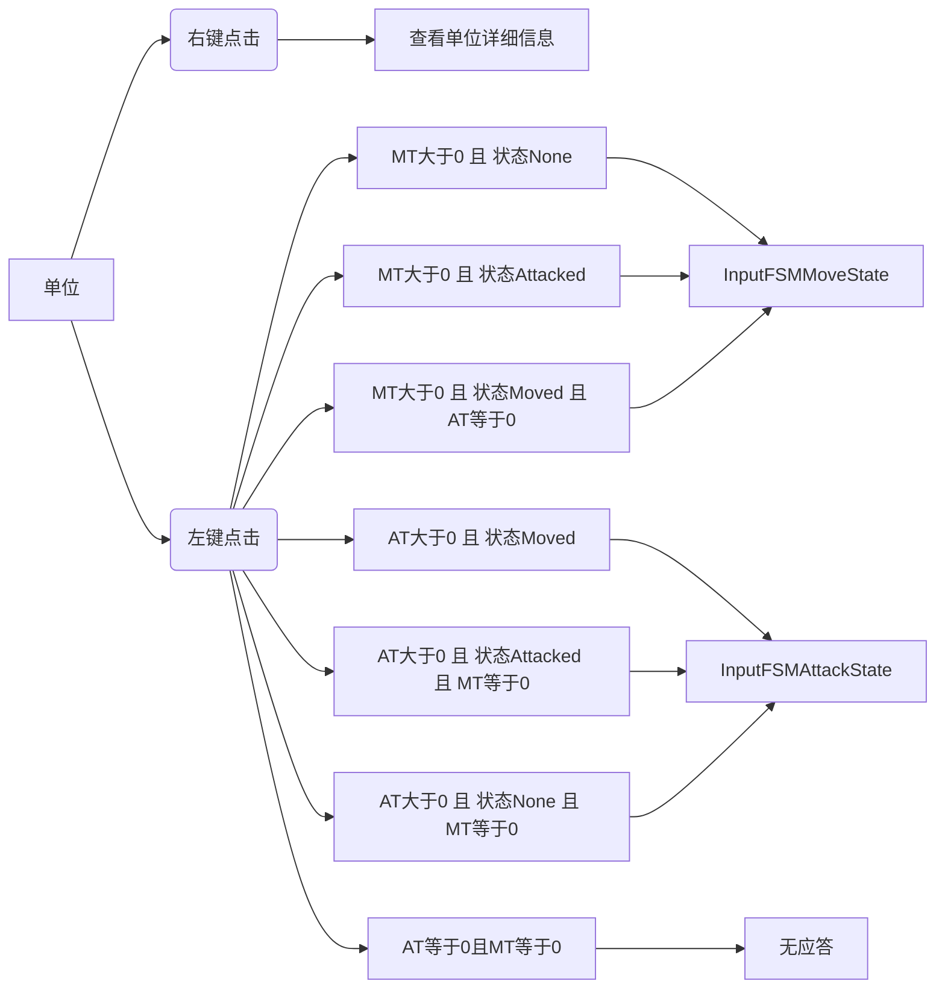
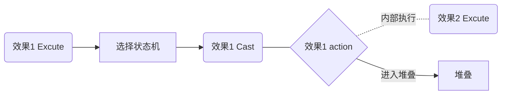
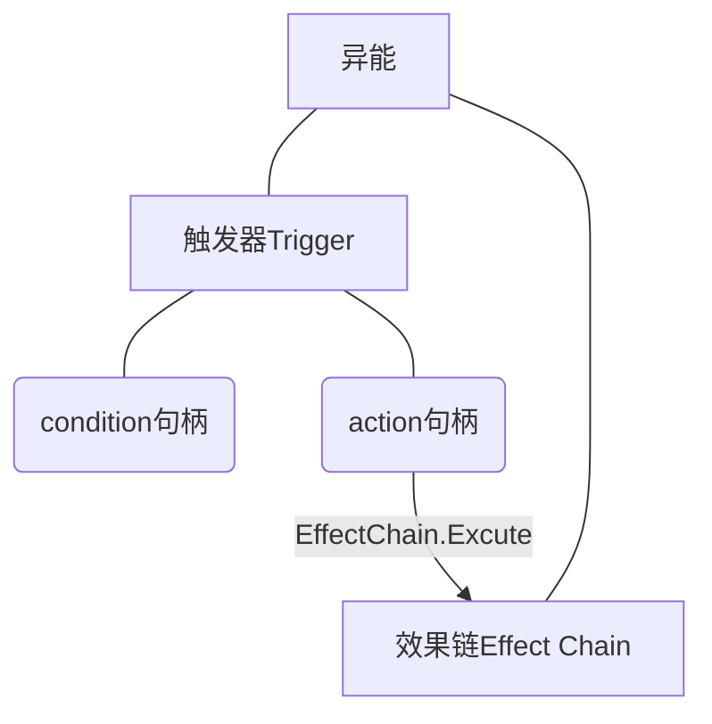

<!-- TOC -->

- [1. 命名规范和其他一些杂七杂八的总则](#1-%E5%91%BD%E5%90%8D%E8%A7%84%E8%8C%83%E5%92%8C%E5%85%B6%E4%BB%96%E4%B8%80%E4%BA%9B%E6%9D%82%E4%B8%83%E6%9D%82%E5%85%AB%E7%9A%84%E6%80%BB%E5%88%99)
  - [1.1. 名词](#11-%E5%90%8D%E8%AF%8D)
  - [1.2. 关于触发器](#12-%E5%85%B3%E4%BA%8E%E8%A7%A6%E5%8F%91%E5%99%A8)
- [2. 外部数据库](#2-%E5%A4%96%E9%83%A8%E6%95%B0%E6%8D%AE%E5%BA%93)
  - [2.1. 单位数据库](#21-%E5%8D%95%E4%BD%8D%E6%95%B0%E6%8D%AE%E5%BA%93)
  - [2.2. 卡牌数据库](#22-%E5%8D%A1%E7%89%8C%E6%95%B0%E6%8D%AE%E5%BA%93)
  - [2.3. 事件数据库](#23-%E4%BA%8B%E4%BB%B6%E6%95%B0%E6%8D%AE%E5%BA%93)
- [3. 类说明](#3-%E7%B1%BB%E8%AF%B4%E6%98%8E)
  - [3.1. 游戏运行](#31-%E6%B8%B8%E6%88%8F%E8%BF%90%E8%A1%8C)
    - [3.1.1. GamePlay](#311-GamePlay)
      - [3.1.1.1. 重构部分](#3111-%E9%87%8D%E6%9E%84%E9%83%A8%E5%88%86)
    - [3.1.2. Encounter](#312-Encounter)
      - [3.1.2.1. 重构部分](#3121-%E9%87%8D%E6%9E%84%E9%83%A8%E5%88%86)
    - [3.1.3. EncounterData](#313-EncounterData)
      - [3.1.3.1. 重要成员](#3131-%E9%87%8D%E8%A6%81%E6%88%90%E5%91%98)
    - [3.1.4. Damage](#314-Damage)
      - [3.1.4.1. 重要成员](#3141-%E9%87%8D%E8%A6%81%E6%88%90%E5%91%98)
  - [3.2. 遭遇及地图](#32-%E9%81%AD%E9%81%87%E5%8F%8A%E5%9C%B0%E5%9B%BE)
    - [3.2.1. BMBCollider](#321-BMBCollider)
      - [3.2.1.1. 重要成员](#3211-%E9%87%8D%E8%A6%81%E6%88%90%E5%91%98)
    - [3.2.2. BattaleMap](#322-BattaleMap)
      - [3.2.2.1. 重构部分：](#3221-%E9%87%8D%E6%9E%84%E9%83%A8%E5%88%86)
  - [3.3. 玩家输入控制](#33-%E7%8E%A9%E5%AE%B6%E8%BE%93%E5%85%A5%E6%8E%A7%E5%88%B6)
    - [3.3.1. GameplayInput](#331-GameplayInput)
      - [3.3.1.1. 重构部分](#3311-%E9%87%8D%E6%9E%84%E9%83%A8%E5%88%86)
      - [3.3.1.2. 重要成员](#3312-%E9%87%8D%E8%A6%81%E6%88%90%E5%91%98)
    - [3.3.2. InputFSM](#332-InputFSM)
      - [3.3.2.1. 重构部分](#3321-%E9%87%8D%E6%9E%84%E9%83%A8%E5%88%86)
      - [3.3.2.2. 重要成员](#3322-%E9%87%8D%E8%A6%81%E6%88%90%E5%91%98)
  - [3.4. 卡牌](#34-%E5%8D%A1%E7%89%8C)
    - [3.4.1. BaseCard](#341-BaseCard)
      - [3.4.1.1. 重构部分](#3411-%E9%87%8D%E6%9E%84%E9%83%A8%E5%88%86)
      - [3.4.1.2. 重要成员](#3412-%E9%87%8D%E8%A6%81%E6%88%90%E5%91%98)
    - [3.4.2. UnitCard](#342-UnitCard)
      - [3.4.2.1. 重构部分](#3421-%E9%87%8D%E6%9E%84%E9%83%A8%E5%88%86)
      - [3.4.2.2. 重要成员](#3422-%E9%87%8D%E8%A6%81%E6%88%90%E5%91%98)
    - [3.4.3. OrderCard](#343-OrderCard)
      - [3.4.3.1. 重构部分](#3431-%E9%87%8D%E6%9E%84%E9%83%A8%E5%88%86)
      - [3.4.3.2. 重要成员](#3432-%E9%87%8D%E8%A6%81%E6%88%90%E5%91%98)
    - [3.4.4. CardManager](#344-CardManager)
      - [3.4.4.1. 重构部分](#3441-%E9%87%8D%E6%9E%84%E9%83%A8%E5%88%86)
      - [3.4.4.2. 重要成员](#3442-%E9%87%8D%E8%A6%81%E6%88%90%E5%91%98)
  - [3.5. 单位](#35-%E5%8D%95%E4%BD%8D)
    - [3.5.1. GameUnit](#351-GameUnit)
      - [3.5.1.1. 重构部分](#3511-%E9%87%8D%E6%9E%84%E9%83%A8%E5%88%86)
    - [3.5.2. Hero - New!](#352-Hero---New)
      - [3.5.2.1. 重要成员](#3521-%E9%87%8D%E8%A6%81%E6%88%90%E5%91%98)
  - [3.6. 异能与效果](#36-%E5%BC%82%E8%83%BD%E4%B8%8E%E6%95%88%E6%9E%9C)
    - [3.6.1. EffectStack - New！](#361-EffectStack---New)
      - [3.6.1.1. 重要成员](#3611-%E9%87%8D%E8%A6%81%E6%88%90%E5%91%98)
    - [3.6.2. Effect - New！](#362-Effect---New)
      - [3.6.2.1. 重要成员](#3621-%E9%87%8D%E8%A6%81%E6%88%90%E5%91%98)
    - [3.6.3. Ability](#363-Ability)
      - [3.6.3.1. 重构内容](#3631-%E9%87%8D%E6%9E%84%E5%86%85%E5%AE%B9)
    - [3.6.4. Buff](#364-Buff)
      - [3.6.4.1. 重要成员](#3641-%E9%87%8D%E8%A6%81%E6%88%90%E5%91%98)
  - [3.7. 事件](#37-%E4%BA%8B%E4%BB%B6)
  - [3.8. 信息收发](#38-%E4%BF%A1%E6%81%AF%E6%94%B6%E5%8F%91)
    - [3.8.1. MsgDispatcher](#381-MsgDispatcher)
      - [3.8.1.1. 重要成员](#3811-%E9%87%8D%E8%A6%81%E6%88%90%E5%91%98)
    - [3.8.2. Trigger](#382-Trigger)
      - [3.8.2.1. 重要成员](#3821-%E9%87%8D%E8%A6%81%E6%88%90%E5%91%98)
  - [3.9. 战斗动画系统](#39-%E6%88%98%E6%96%97%E5%8A%A8%E7%94%BB%E7%B3%BB%E7%BB%9F)
    - [3.9.1. AnimateCommand](#391-AnimateCommand)
      - [3.9.1.1. 重要成员](#3911-%E9%87%8D%E8%A6%81%E6%88%90%E5%91%98)
      - [3.9.1.2. 子类成员](#3912-%E5%AD%90%E7%B1%BB%E6%88%90%E5%91%98)
    - [3.9.2. AnimateQueue](#392-AnimateQueue)
      - [3.9.2.1. 重要成员](#3921-%E9%87%8D%E8%A6%81%E6%88%90%E5%91%98)
    - [3.9.3. AnimateReceiver](#393-AnimateReceiver)
      - [3.9.3.1. 重要成员](#3931-%E9%87%8D%E8%A6%81%E6%88%90%E5%91%98)
- [4. 遭遇运行逻辑控制和流程](#4-%E9%81%AD%E9%81%87%E8%BF%90%E8%A1%8C%E9%80%BB%E8%BE%91%E6%8E%A7%E5%88%B6%E5%92%8C%E6%B5%81%E7%A8%8B)
  - [4.1. 遭遇初始化](#41-%E9%81%AD%E9%81%87%E5%88%9D%E5%A7%8B%E5%8C%96)
  - [4.2. 回合开始 - 从AIEnd到MPBegin](#42-%E5%9B%9E%E5%90%88%E5%BC%80%E5%A7%8B---%E4%BB%8EAIEnd%E5%88%B0MPBegin)
  - [4.3. 回合结束 - 从MPEnd到AIBegin](#43-%E5%9B%9E%E5%90%88%E7%BB%93%E6%9D%9F---%E4%BB%8EMPEnd%E5%88%B0AIBegin)
  - [4.4. 单位部署](#44-%E5%8D%95%E4%BD%8D%E9%83%A8%E7%BD%B2)
  - [4.5. 单位指令](#45-%E5%8D%95%E4%BD%8D%E6%8C%87%E4%BB%A4)
    - [4.5.1. InputFSMIdleState](#451-InputFSMIdleState)
    - [4.5.2. InputFSMMoveState](#452-InputFSMMoveState)
    - [4.5.3. InputFSMAttackState](#453-InputFSMAttackState)
  - [4.6. 战斗结算](#46-%E6%88%98%E6%96%97%E7%BB%93%E7%AE%97)
  - [4.7. 移动流程](#47-%E7%A7%BB%E5%8A%A8%E6%B5%81%E7%A8%8B)
  - [4.8. 效果链执行](#48-%E6%95%88%E6%9E%9C%E9%93%BE%E6%89%A7%E8%A1%8C)
  - [4.9. 堆叠的运作机制](#49-%E5%A0%86%E5%8F%A0%E7%9A%84%E8%BF%90%E4%BD%9C%E6%9C%BA%E5%88%B6)
  - [4.10. 卡牌施放](#410-%E5%8D%A1%E7%89%8C%E6%96%BD%E6%94%BE)
  - [4.11. 异能触发](#411-%E5%BC%82%E8%83%BD%E8%A7%A6%E5%8F%91)
- [5. 注意事项和通用类的使用](#5-%E6%B3%A8%E6%84%8F%E4%BA%8B%E9%A1%B9%E5%92%8C%E9%80%9A%E7%94%A8%E7%B1%BB%E7%9A%84%E4%BD%BF%E7%94%A8)
  - [5.1. FSMachine<T>和FSMState](#51-FSMachineT%E5%92%8CFSMState)
    - [5.1.1. 例子：](#511-%E4%BE%8B%E5%AD%90)
  - [5.2. UnitySingleton](#52-UnitySingleton)
    - [5.2.1. 例子：](#521-%E4%BE%8B%E5%AD%90)

<!-- /TOC -->

# 1. 命名规范和其他一些杂七杂八的总则

尽量遵守吧

## 1.1. 名词

+ 法咒（Ark）
  + 原先的战技
+ 战区（Region）
+ 范围（Area）
  + 主要指的是施法的影响范围，分为爆发范围（BurstArea）和射线范围（LaserArea）两种。
+ 单位（Unit）
+ 回合（Turn）
+ 光环（Halo）
+ 手牌（Hand）
+ 牌库（Deck）
  + 指的是被抽的那个牌库
+ 阶段（Phase）
+ 触发器（Trigger）
+ 异能（Ability）
+ 咒语（Spell）
+ 召唤（Summon）

## 1.2. 关于触发器

触发器（Trigger）中的信息类型不是用来触发去做某件事的。

比如MessageType中的DrawCard，我发送DrawCard信息不是为了去抽一张牌，而是为了告知其他Reciver我抽了一张牌。要抽牌的时候请调用抽牌的方法。

也就是说，我不是发送抽牌信号来抽牌，而是因为我抽了牌所以发送抽牌信号；我不是发送施放咒语信号来施放咒语，而是因为我施放了咒语所以发送施放咒语信号。能够在Gameplay里明确定向到具体固定方法的时候不要依赖Trigger来实现。

# 2. 外部数据库

## 2.1. 单位数据库

```json
{
  "Ability": ["单位所具有的异能列表"],
  "Atk": 4,
  "Color": [
    "U"
  ],
  "Text": "单位所记录的文本",
  "Event": {"这里是":"事件模块"},
  "HasCD": 0,
  "Hp": 10,
  "ID": "单位ID",
  "Mov": 0,
  "Name": "单位名字",
  "Spd": 0,
  "Rng": 3,
  "Tag": [
    "传奇"
  ],
  "Ct":0
},
```

## 2.2. 卡牌数据库

```json
{
    "ID": "这里是卡牌id",
    "Spell":"这里是卡牌携带的Spell",
    "Unit":"这里是卡牌对应的单位id",
    "Color": [
        "G",
        "R",
        "U",
        "P",
        "W"
    ],
    "Cost": 2,
    "Text": "这里是卡牌具有的文本",
    "Flavor": "这里是卡牌的风味文字",
    "Name": "卡牌名称",
    "Tag": [
        "这里是标签"
    ],
    "AbilityAttach": [
        "附加给携带者的异能列表"
    ],
    "Type": "Order / Unit"
},
```

## 2.3. 事件数据库

# 3. 类说明

## 3.1. 游戏运行

+ 如果确认GameJudge没有用，记得把他删了。
+ Mediator的内容也想办法删了。AbilityMediator里面的内容陆陆续续移动到其他地方，Deck类换一个地方摆着。

### 3.1.1. GamePlay

命名空间：GamePlay

说明：游戏逻辑的单例管理类，原则上，除UI和数据库外的大类都应被GamePlay持有以方便全局调用并管理，用这种方式避免使用额外的单例造成负担。  
实现细节：类的创建均放在了Awake()中，避免有脚本图方便在Start中调用大类造成错误。在战斗地图中所有类一律不准使用Awake()做初始化和逻辑的处理，请在Start里做

#### 3.1.1.1. 重构部分

+ 把BattleMap的start内容移到Gameplay的start下面来。（完成）
+ 把回合自流动的部分转移到RoundProcessController下面去。
+ 取消移动范围显示的代码去该去的地方……我也不知道该去哪里但应该不是gameplay。（完成，移到了ShowRange下面）
+ 初始化过程中在这里注册全局Trigger。

### 3.1.2. Encounter

命名空间：GamePlay

说明：全局信息。

#### 3.1.2.1. 重构部分

+ 加入成员，以后统一从此处查询：
  + 玩家死页数
  + 最大可持有死页数
  + 玩家最大手牌数
  + 玩家初始手牌数
  + 玩家每回合抽牌数
  + 玩家当前专注
  + 玩家默认专注
  + isLeader的单位实例

### 3.1.3. EncounterData

命名空间：GamePlay.Encounter

说明：遭遇数据的单例管理类。汇总和管理所有与遭遇相关的成员和方法。大部分情况被BattaleMap或BattleArea调用

#### 3.1.3.1. 重要成员

+ public void InitEncounter(string encounterID)
    + 根据遭遇ID从json文件读取对应的遭遇数据，并将其保存在私有成员_encounterData中
+ public void InitBattleFieldEvent(string encounterID)
    + 根据遭遇ID从encounterData中读取战区事件，并保存在私有成员battleAreaEventsDic中
+ public List<EventModel> GetBattleFieldEvent(int regionID)
    + 根据战区ID从battleAreaEventsDic中读取战区事件列表
+ public BattlefieldMessage GetBattlefieldMessagebyID(int regionID,string encounterID)
    + 根据战区ID和遭遇ID从encounterData中读取战区列表battleFieldMessageList，并从battleFieldMessageList中读取对应战区ID的战区

### 3.1.4. Damage

命名空间：GamePlay

说明：伤害类，存储伤害的信息和伤害公式。

#### 3.1.4.1. 重要成员

+ public Damage(int damageValue)
  + 伤害的构造方法。
+ public static void DealDamage(GameUnit.GameUnit source, GameUnit.GameUnit taker, Damage damage, bool post = true)
  + 对一个单位造成伤害。source为伤害来源，taker为受伤者，damage为伤害实例。post默认为true，为是否发送伤害发生的信息，如无特别需要不需更改。
+ public static void DealDamages(List<GameUnit.GameUnit> sources, List<GameUnit.GameUnit> takers, List<Damage> damages)
  + 想同时造成多个伤害时使用的方法。造成这些伤害的间隙因为不发送伤害信息不会插入其他代码的执行。

## 3.2. 遭遇及地图

### 3.2.1. BMBCollider

说明：碰撞器，主要进行碰撞检测，指定范围之后每次当碰撞器可能发生变化的时候进行刷新。

#### 3.2.1.1. 重要成员

+ public BMBCollider(GameUnit.GameUnit unit, List<Vector2> bound)
+ public BMBCollider(BattleMapBlock mapBlock, List<Vector2> bound)
  + 第一类构造方法，参数是中心和对于中心相对位置。当中心移动的时候碰撞器检测的地格会跟随改变，依靠相对位置刷新。
+ public BMBCollider(GameUnit.GameUnit unit, bool isBMA)
  + 第二类构造方法，参数是检测单位和是否战区碰撞器。当其为真时碰撞器将会把与参数单位同属于一个战区的地格纳入检测之中。当单位移动进入另一个战区时，碰撞器检查的地格会随之更新。
+ public BMBCollider(List<Vector2> battleArea)
  + 第四类构造方法，恒定碰撞器，固定检测几个地格的变化。参数是指定的检测范围。
+ public List<Unit> enterUnits = new List<Unit>();
  + 进入此碰撞监测区域的单位。
+ public List<Unit> exitUnits = new List<Unit>();
  + 离开此碰撞检测区域的单位。
+ public List<Unit> disposeUnits = new List<Unit>();
  + 在这个碰撞检测区域内的单位。

### 3.2.2. BattaleMap

命名空间：BattleMap

说明：战斗地图的单例管理类。汇总和管理所有与战斗地图相关的成员和方法

#### 3.2.2.1. 重构部分：

+ InitMap的工作移交Gameplay，改为主力负责InitAndInstantiateMapBlocks。

## 3.3. 玩家输入控制

### 3.3.1. GameplayInput

命名空间：Gameplay.Input

说明：玩家输入的控制类，被GamePlay持有引用，游戏操作逻辑的真正执行实际由成员InputFSM处理。GameplayInput只是将接口暴露在全局，并与InputFSM进行对接

#### 3.3.1.1. 重构部分

+ 添加左键点击和右键点击的接口。
  + 完成对应的暴露出来的方法。
  + 执行对应方法的时候对EventData里面的Button进行检测，检查是Left还是Right。
+ 添加点击待命区（CD池）和事件区的接口。

#### 3.3.1.2. 重要成员

+ public InputFSM InputFSM
  + 玩家输入的执行器，真正根据情况选择不同游戏逻辑的执行者
+ public void OnPointerDownBlock(BattleMapBlock mapBlock, PointerEventData eventData)
  + 暴露给棋子和地图方块的操作接口，调用时机和函数名一致。例如这个就是左键点击地图块的接口。
+ public void OnPointerDownFriendlyLeft(GameUnit.GameUnit unit, PointerEventData eventData)
  + 左键点击友方单位。
+ public void OnPointerDownEnemyLeft(GameUnit.GameUnit unit, PointerEventData eventData)
  + 左键点击敌方单位。
+ internal void OnPointerDownUnitCardLeft(GameObject currentItemInstance)
  + 点击手牌中的单位牌。
+ public void OnUseOrderCard(Ability.Spell spell)
  + 点击手中的指令牌并使用之。
+ public void OnPointerDownCdHeroLeft(GameObject currentItemInstance)
  + 点击恢复区正在恢复的英雄。
+ public void OnPointerDownChoisenCard(GameObject currentItemInstance)
  + 点击弹框中备选的卡牌选项。

### 3.3.2. InputFSM

命名空间：Gameplay.FSM

说明：执行玩家输入的有限状态机，通过变更成员StateStack的栈顶来调节对玩家操作的响应。StateStack是为了可以实现操作回撤，即下推状态机（然而现在看起来完全没有打算做这个回撤的打算）。为了方便状态的切换，InputFSM会寄存部分玩家的输入信息。

#### 3.3.2.1. 重构部分

+ TargetList改为存储点击的对象。这一项处理起来可能会相对比较困难，要重写很多东西。
+ SelectState和CastState要能够正确处理各项右键点击进行撤回和取消。

#### 3.3.2.2. 重要成员

+ public List<object> TargetList;
    + 存储点击的对象
+ public Ability.Ability ability;
    + 存储当前正要处理的异能，用来处理和异能相关的内容

## 3.4. 卡牌

### 3.4.1. BaseCard

命名空间：GameCard

说明：卡牌的基类。

#### 3.4.1.1. 重构部分

+ 依照新的成员结构进行更新。

#### 3.4.1.2. 重要成员

+ string id
  + 卡牌的id，作为从数据库索取相关卡片信息的唯一标识。
+ string name
  + 卡牌的名称
+ int cost
  + 卡牌需要消耗的专注值
+ List<Color> color
  + 卡牌所具有的颜色。
+ Type type
  + 卡牌是咒语型（指令牌）还是召唤型（单位牌）。
+ List<string> tags
  + 卡牌所具有的标签。
+ string text
  + 卡牌所记述的规则文字。
+ string flavorText
  + 卡牌所记述的风味文字。
+ bool willDestroy
  + 关于卡牌是否在生效后被销毁。
+ Hero carrier
  + 这张牌的携带者。

### 3.4.2. UnitCard

命名空间：GameCard

说明：召唤牌，也就是过去的单位牌，BaseCard的子类。

#### 3.4.2.1. 重构部分

+ 将部分成员移交到GameCard所独有。

#### 3.4.2.2. 重要成员

+ string unitid
  + 所召唤的单位的id。
+ List<string> abilitiesOnUnit
  + 所召唤的单位除了数据库所记述的异能以外额外获得的异能的id。

### 3.4.3. OrderCard

命名空间：GameCard

说明：咒语牌，也就是过去的指令牌，BaseCard的子类。

#### 3.4.3.1. 重构部分

+ 修改咒语牌的发动方式，去Trigger化。详情见

#### 3.4.3.2. 重要成员

+ string spell
  + 携带的咒语id。

### 3.4.4. CardManager

命名空间：GameCard

说明：卡牌管理器。

#### 3.4.4.1. 重构部分

+ 把一些变量转移到Encounter类去。详情见
+ 把一些用于测试的方法处理一下。
+ 手牌、牌库和待命区直接储存实例。

#### 3.4.4.2. 重要成员

待补充

## 3.5. 单位

写累了，偷个懒，把新东西写了。

### 3.5.1. GameUnit

命名空间：GameUnit

#### 3.5.1.1. 重构部分

+ 加入适性（Enhence），也就是加四个成员：rEnhence、uEnhence、gEnhence和pEnhence。
+ 加入剩余移动次数（MT），剩余施法次数（CT）和剩余攻击次数（AT）。
+ 加入上次行动标识，记录单位是刚刚移动过、刚刚攻击过还是本回合还什么都没有做。具体运作见

### 3.5.2. Hero - New!

命名空间：GameUnit

说明：英雄类，GameUnit的子类。跟一般的单位类比起来多一套运作机制。

#### 3.5.2.1. 重要成员

+ List<string> abilities
  + 英雄所具有的异能的id列表。每次英雄重新部署的时候按照这个添加异能上去。
+ List<BaseCard> arks
  + 英雄所携带的战技牌。指针，指向他的单卡。如果该牌已经被销毁，则从这里移除。
+ int recoverRate
  + 英雄在恢复区每回合获得的恢复量。
+ int recovered
  + 英雄累积的恢复量，超过最大生命值的时候即为CD完成。

## 3.6. 异能与效果

### 3.6.1. EffectStack - New！

命名空间：Ability

说明：效果句柄堆叠。

#### 3.6.1.1. 重要成员

+ public void push(EffectAction action)
  + 将效果句柄压入堆叠
+ public List<EffectAction> actions
  + 堆叠中的句柄列表，开始执行的时候由后至前依次执行。
+ public void turnsOn()
  + 令堆叠开始逐个pop并执行句柄，直到堆叠清空。
+ public void turnsOff()
  + 令堆叠暂停工作。务必保证在暂停工作之后重启他继续直至排空堆叠。

### 3.6.2. Effect - New！

命名空间：Ability

说明：效果类，负责效果的选择和执行。有一种特殊的效果类为Spell类，在一般效果类基础上增加持有AbilityVariable，并且在Cast的时候会调用卡牌管理器对手牌信息和玩家专注进行操作，并发送施放卡牌的信息。

#### 3.6.2.1. 重要成员

+ public void Cast()
  + 暴露给外部施放此牌的方法
+ public void action()
  + 此牌的效果句柄
+ public void SelectionOver()
  + 为此牌选择完效果对象之后执行的方法。一般而言对于选取对象的效果需要在这个方法内将选取的对象存储到自身Effect成员中，方便action使用。

### 3.6.3. Ability

命名空间：Ability

说明：异能类。

#### 3.6.3.1. 重构内容

+ 主要是删东西所以就不写重要成员了。等重构完了再来写。
+ 异能目标的概念删除，改为效果对象。异能现在不持有对象约束。
+ 异能不再打表维护了，去外部存储化，目前来看横看竖看都没有外部维护的必要，跟卡牌、单位和事件之类的不同，外部维护只会增加麻烦。
+ 异能是个纯单位概念，不要给非单位绑异能。
+ 特别说一句，对于触发式异能（什么什么时怎么怎么做的这种异能）用Trigger实现的时候，在Trigger的Action里面执行对应的Effect.Excute()就好。对于多段效果的异能，就上一个Effect的action套下一个Effect的Excute依次执行过去。

### 3.6.4. Buff

命名空间：Ability.Buff

说明：Buff类。

#### 3.6.4.1. 重要成员

+ public void SetLife(float life)
  + 设置Buff的生命周期，0.5一个玩家回合/AI回合，1一个玩家回合+AI回合。为负的时候会被设置为永久Buff。
+ virtual public void InitialBuff() { }
  + 设定Buff被赋予时要做的事情
+ virtual public void OnSubtractBuffLife() { }
  + 设定buff的CD在回合结束根据规则减少时触发的效果
+ virtual protected void OnDisappear() { }
  + 设定Buff消失时要做的事情，只要buff消失一定会发生，无论是正常读完的还是被外力清除的。
+ virtual public void OnComplete() { }
  + 设定Buff按照回合数读完发生的事情，比如那种倒计时效果。
+ virtual public void setVariable(AbilityVariable variable)
  + 对于需要使用异能变量的buff重载这个方法来进行书写。参数AbilityVariable。

## 3.7. 事件

待补完

## 3.8. 信息收发

### 3.8.1. MsgDispatcher

命名空间：IMessage

说明：广播站，用于注册接收者和发送信息。

#### 3.8.1.1. 重要成员

+ public static void RegisterMsg()
  + 注册信息。有三种注册方法，两种是有实体接收者的，一种只有全局接收者。具体的内容看注释。
+ public static void SendMsg(int msgName, MsgReceiver targetReceiver = null)
  + 发送信息。msgName是MessageType的编号，targetReciver不为空的时候这是一个仅发送给指定目标的单播。

### 3.8.2. Trigger

命名空间：IMessage

说明：触发器类。

#### 3.8.2.1. 重要成员

+ public Condition condition;
  + 触发时的条件判断句柄
+ public Action action;
  + 触发时的执行句柄

## 3.9. 战斗动画系统
此处动画仅限于遭遇战斗的动画使用，因为遭遇的动画要与异能的释放或单位的行为绑定，并且加入到一个队列中进行顺序播放，所以需要特殊处理

### 3.9.1. AnimateCommand
命名空间：Animate

基类：IPlay

说明：单个动画类的基类，单独实例化没有意义。

#### 3.9.1.1. 重要成员

+ protected virtual void StartPlayAnimate()
  + 播放动画的虚方法，被子类重载后填写这个动画子类的实际执行内容
+ protected void OnFinished()
  + 动画播放回调，被动画队列AnimateQueue依赖，功能是在播放下一个在动画队列中的动画。应当要在动画子类的动画播放完后调用该方法。

#### 3.9.1.2. 子类成员
+AttackAnimate 单位攻击动画类
+StateUp1Animate 单位状态提升动画类

### 3.9.2. AnimateQueue
命名空间：GameUtility.Animate

说明：战斗动画的播放队列，当队列不为空时自动播放动画直到队列为空为止。继承了单例类所以允许任何类对动画队列当前是否正在播放动画进行查询

#### 3.9.2.1. 重要成员
+ public void AddPlay(IPlay play)
  + 向动画队列中添加动画，如果当前动画队列为空则会自动开启动画播放直到队列不为空
+ public bool IsAnimating 
  + 外部可通过获取该成员得知当前动画队列是否正在播放动画 

### 3.9.3. AnimateReceiver
命名空间：Animate

说明：动画接收器，防止在GameObject上辅助进行动画播放的脚本，功能如同名字，接收播放动画的命令，并翻译成当前
GameOjbect上的AnimatorController（U3d的动画控制状态机）可以使用的指令。并在动画播放完毕后，调用回调函数。

#### 3.9.3.1. 重要成员
+ public void OnFinish()
  + AnimatorController的动画执行完毕后需要调用这个方法。具体方法百度如何在U3d的动画状态机中执行某个方法
+ public Action OnFinishAnimate
  + 暴露给动画指令的回调句柄，建议使用赋值而不是+=，这样在动画播放结束后不需要使用逆操作-=删除与动画句柄的连接。使用样例详见AttackAnimate

# 4. 遭遇运行逻辑控制和流程

## 4.1. 遭遇初始化

遭遇的初始化依赖于2个信息：牌库信息（Deck实例）和遭遇id（string）。

这部分回头再写，累了。

## 4.2. 回合开始 - 从AIEnd到MPBegin

留空pass

## 4.3. 回合结束 - 从MPEnd到AIBegin

留空pass

## 4.4. 单位部署

留空pass

## 4.5. 单位指令

涉及到的概念：

+ 攻击次数At
+ 移动次数MT
+ 上次行动标识：Attacked、Moved、None

值得一提的是，理应有标识指出左键点击单位之后会执行攻击还是移动还是无应答。目前棋子颜色的明暗只能指出前两者与后者的区别。

### 4.5.1. InputFSMIdleState



### 4.5.2. InputFSMMoveState

+ 左键点击不可移动到的地块：无应答
+ 左键点击可移动到的非当前所在的地块：移动（详情见移动行为流程），扣除MT，设置状态为Moved。
+ 左键点击当前所在地块：放弃移动
+ 右键点击任意区域：撤销移动指令

### 4.5.3. InputFSMAttackState

+ 左键点击不可攻击区域：无应答
+ 左键点击可攻击区域：进行攻击（详情见伤害结算流程），扣除AT，设置状态为Attacked。
+ 左键点击自己：无应答
+ 右键点击任意区域：撤销攻击指令

可以看到攻击指令并没有可以放弃的部分，如果一个单位状态为Moved且有未用完的MT，那么除非他真的攻击了一次、或者施法消耗掉了自己的AT，否则他是不能用他的额外MT去移动的。

## 4.6. 战斗结算

留空pass

## 4.7. 移动流程

留空pass

## 4.8. 效果链执行

效果的定义详情见万律大全。对于复杂的多段效果，我们用效果链的方式实现。效果链由复数个效果构成，每个效果持有一个Excute和Cast。其中Excute负责开启一次选择，在此期间中止堆叠运作形成阻塞，等候选择完毕；Cast则于选择完毕后启动，负责将效果句柄添加到堆叠，并重启堆叠。当我们需要实现一个效果链的时候，我们可以将下一个效果的Excute添加到上一个效果的效果句柄中，从而实现一个接一个效果地执行过去，从而完成复杂的多段效果的结算。



## 4.9. 堆叠的运作机制

留空pass

## 4.10. 卡牌施放

留空pass

## 4.11. 异能触发

异能触发是对于触发式异能而言的概念。一个触发式异能含有两个成分：触发条件（Condition），和触发后执行的效果链（Effect Chain）。我们用Trigger来实现一个触发式异能的触发。首先我们需要初始化一个异能。一个异能触发式持有以下成员：



在这里condition句柄充当者触发条件的职能。而触发器的action句柄则用来开启效果链的执行。

# 5. 注意事项和通用类的使用

## 5.1. FSMachine<T>和FSMState

说明：通用有限状态机类和对应的有限状态机状态类。这两个类并不能直接使用，正确用法是将其作为基类继承

### 5.1.1. 例子：

``` c##
class InputFSM : FSMachine<InputFSMState> //这是有限状态机的声明
class InputFSMState : FSMState //这是对应有限状态机的状态的声明
```

## 5.2. UnitySingleton

说明：单例通用类，用以给某一基类是monobehaviour的class创建并约束实例唯一并可在任意代码块引用到

### 5.2.1. 例子：

``` c#
public class BattleMap : UnitySingleton<BattleMap>
{}
```

引用唯一实例的方法：ClassName.Instance()

实现细节：这个类在一个场景被第一次调用实例时，会在场景搜索使用了该基类的c##脚本，如果这个脚本存在则保存为唯一实例并返回，若不存在则以该实例的classname创建一个gameobject并挂载对应的c##脚本并保存为唯一实力并返回。所以如果在场景里没有提前放置单例脚本，则会在运行的过程中在场景中创建。

注意事项：因为unity的场景加载是将这个场景里的预制件全部生成一遍，所以单例一旦有dontdestroy的需求就会造成加载场景后会有多个单例的gameobject，需要尽量避免这两种需求的同时出现，要么放弃使用单例。在任何时候，尽量少地使用单例，原则上能不使用就不使用
